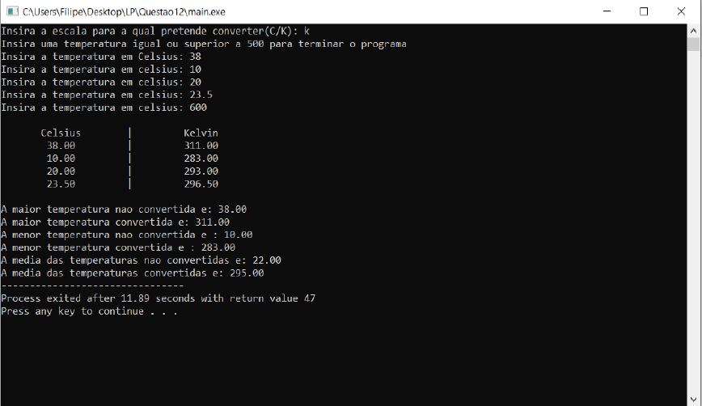

# Convertor-de-Temperaturas-Kelvin-Celsius-
### Programa que faz conversões entre as duas escalas de temperaturas, Kelvin e Celsius 
Trabalho desenvolvido para cimentar os conhecimentos adquiridos nas cadeiras de Linguagens de Programação e Algoritmos e Estruturas de Dados.

**O objetivo da aplicação consiste em conversões entre as duas escalas de temperaturas, Kelvin e Celsius com base em dois valores de entrada: a escala de conversão pretendida e a lista das temperaturas.**

**A aplicação contém ainda as seguintes característiscas:**

* O utilizador pode introduzir 𝑛 temperaturas;
* Apresentação de um quadro com todas as temperaturas inseridas e a respetiva conversão, indicando qual a escala de cada coluna apresentada;
* Informa o utilizador acerca da média das temperaturas,assim como a maior e a menor delas, na escala original e de conversão;

Se quiser utilizar o programa basta:
* Executar o ficheiro denominado "main.exe".

Aqui tem um exemplo do programa em execução:

